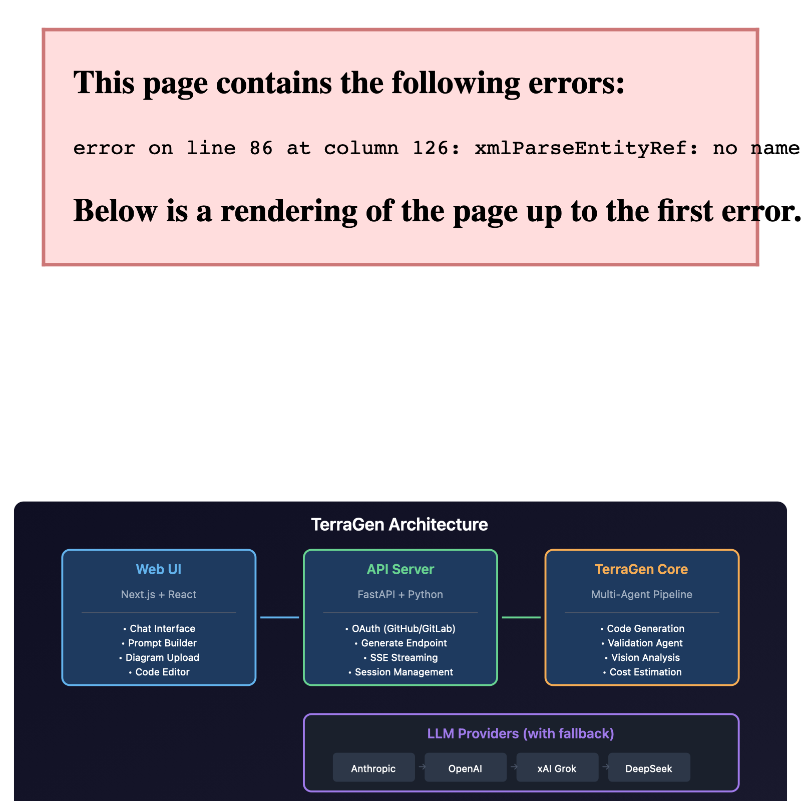
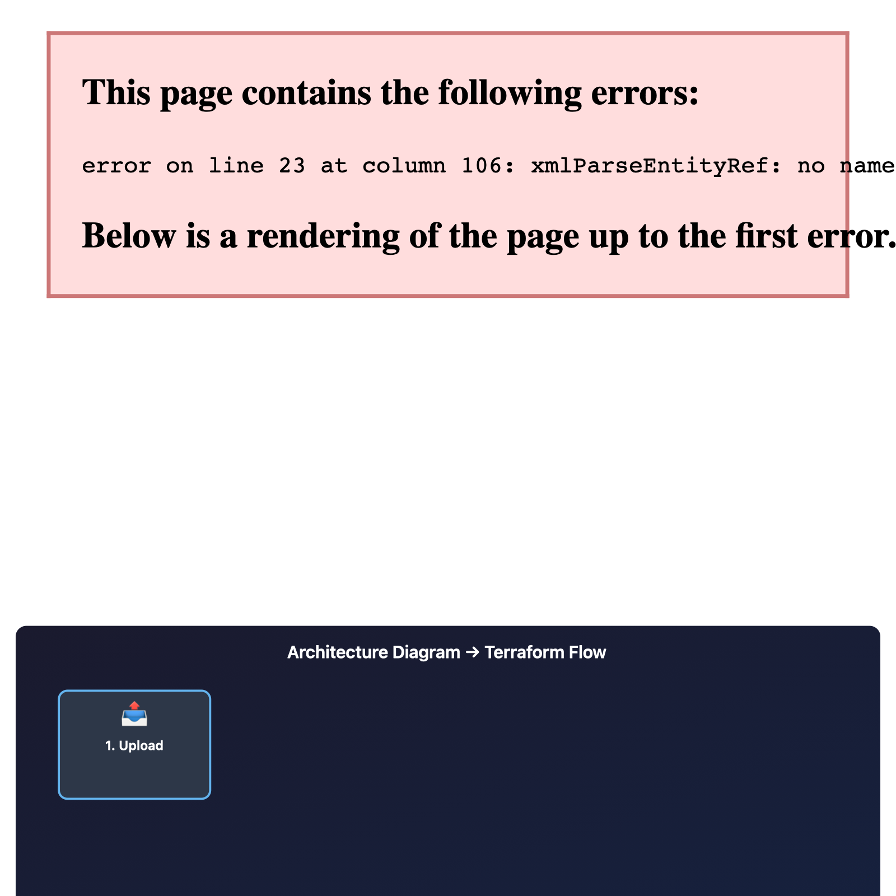
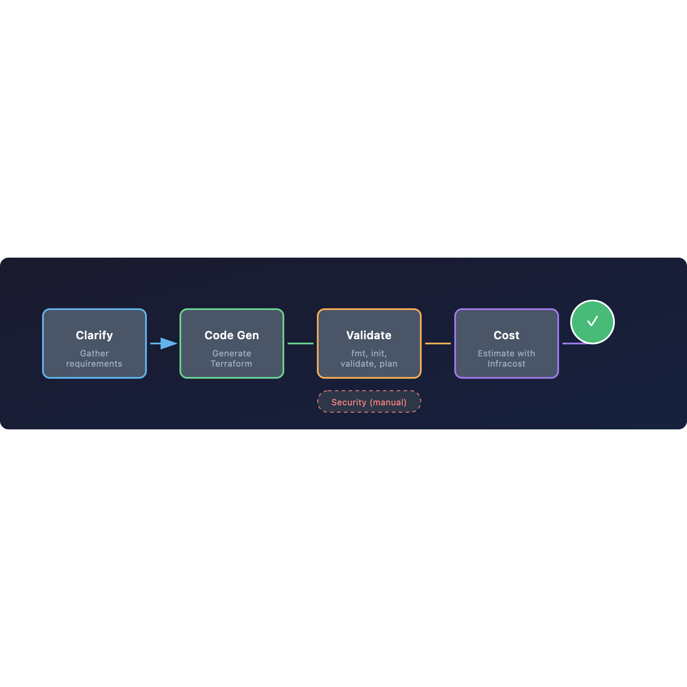

# TerraGen

AI-powered Terraform code generator with multi-LLM support, architecture diagram analysis, and intelligent model routing.



## Features

- **Natural Language to Terraform** - Describe your infrastructure, get production-ready code
- **Architecture Diagram to Code** - Upload AWS/GCP/Azure diagrams, get Terraform (Claude Vision)
- **Multi-LLM Support** - OpenAI GPT-4o, Anthropic Claude, xAI Grok, DeepSeek with automatic fallback
- **Intelligent Model Routing** - Routes simple tasks to cheaper models, complex tasks to powerful ones
- **Prompt Caching** - 90% cost reduction on repeated prompts (Anthropic)
- **Multi-Agent Pipeline** - Clarification → Code Generation → Validation → Cost Estimation
- **Security Scanning** - tfsec, Checkov available on-demand from options panel
- **Agentic Loop** - Auto-validates, fixes errors, and retries until code works
- **Real-time Progress** - Web UI shows pipeline stages, logs, and live updates via SSE
- **Modify Existing Infrastructure** - Update existing Terraform repos with new requirements
- **Interactive Mode** - Asks clarifying questions for better code generation
- **Chat Mode** - Continue conversation to refine generated code
- **Learn from Existing Repos** - Follows your team's patterns and conventions
- **Remote State Backends** - S3, GCS, Azure Blob, Terraform Cloud support
- **Multi-Cloud** - AWS, GCP, Azure support
- **CI/CD Generation** - Includes GitHub Actions workflows
- **Git Integration** - Auto-creates branches, commits, and PRs for changes

## Installation

### CLI Only

```bash
pip install -e .
```

### Full Stack (CLI + Web UI)

```bash
# Install Python dependencies
pip install -e ".[api]"

# Install frontend dependencies
cd web && npm install && cd ..

# Configure
cp .env.example .env
# Edit .env with your keys
```

## Quick Start (Web UI)

```bash
./start.sh
```

Opens:
- Frontend: http://localhost:3000
- API: http://localhost:8000
- API Docs: http://localhost:8000/docs

## Configuration

```bash
# LLM Provider API Keys (at least one required)
export ANTHROPIC_API_KEY=sk-ant-...    # Claude Sonnet/Opus
export OPENAI_API_KEY=sk-...            # GPT-4o (recommended primary)
export XAI_API_KEY=xai-...              # Grok 4.1
export DEEPSEEK_API_KEY=sk-...          # DeepSeek (cheapest)

# Optional - Override default models
export TERRAGEN_ANTHROPIC_MODEL=claude-sonnet-4-20250514
export TERRAGEN_OPENAI_MODEL=gpt-4o
export TERRAGEN_XAI_MODEL=grok-4-1
export TERRAGEN_DEEPSEEK_MODEL=deepseek-chat

# Optional - Change fallback order (comma-separated)
export TERRAGEN_LLM_FALLBACK_ORDER=openai,xai,anthropic,deepseek

# Optional - AWS credentials for terraform plan
export AWS_ACCESS_KEY_ID=AKIA...
export AWS_SECRET_ACCESS_KEY=...
```

### LLM Provider Comparison

| Provider | Model | Input $/1M | Output $/1M | Best For |
|----------|-------|-----------|-------------|----------|
| OpenAI | gpt-4o | $2.50 | $10.00 | Reliable, good quality |
| Anthropic | claude-sonnet-4 | $3.00 | $15.00 | Best quality, complex infra |
| xAI | grok-4-1 | $3.00 | $15.00 | Fast, good tool calling |
| xAI | grok-4-1-fast | $0.20 | $0.50 | Cheapest for simple tasks |
| DeepSeek | deepseek-chat | $0.14 | $0.28 | Budget option |

**Recommended setup:** GPT-4o primary (reliable + cost-effective), Sonnet fallback (best quality)

### Intelligent Model Router (Classifier)

TerraGen includes a complexity classifier that analyzes your prompt and routes to the optimal model:

```
┌─────────────────┐      ┌──────────────┐      ┌─────────────────┐
│  User Prompt    │  →   │  Classifier  │  →   │  Selected Model │
│                 │      │  (scoring)   │      │                 │
│ "Create EKS     │      │  Score: 85   │      │  claude-sonnet  │
│  with RDS"      │      │  Tier: COMPLEX│     │  (best quality) │
└─────────────────┘      └──────────────┘      └─────────────────┘
```

| Complexity | Score | Example Resources | Model Selected |
|------------|-------|-------------------|----------------|
| Simple | 0-30 | S3, IAM user, SNS topic | grok-4-1-fast, gpt-4o-mini |
| Medium | 31-70 | Lambda, EC2, VPC, ALB | grok-4-fast, gpt-4o |
| Complex | 71-100 | EKS, multi-region, compliance | claude-sonnet, grok-4-1 |

**Complexity Scoring Rules:**

| Pattern | Points | Example |
|---------|--------|---------|
| EKS, GKE, Kubernetes | +25 | "EKS cluster with node groups" |
| Transit Gateway, VPN | +20 | "Transit gateway between VPCs" |
| Multi-region, DR | +20 | "Multi-region disaster recovery" |
| Compliance (HIPAA, PCI) | +20 | "HIPAA compliant infrastructure" |
| RDS, Aurora, DynamoDB | +15 | "RDS PostgreSQL with replicas" |
| Production environment | +15 | "Production EKS cluster" |
| Lambda, serverless | +8 | "Lambda function with API Gateway" |
| EC2, VPC, subnets | +5-6 | "VPC with public/private subnets" |
| S3, simple storage | +3 | "S3 bucket with versioning" |
| Simple, basic, demo | -10 | "Simple S3 bucket for testing" |

**Cost savings with routing:**
```
Without routing: All requests → Claude Sonnet ($3/1M input)
With routing:    Simple tasks → Grok Fast ($0.20/1M input) = 93% savings
                 Complex tasks → Claude Sonnet (best quality)
```

**Enable routing in code:**
```python
from terragen.llm import UnifiedLLMClient

client = UnifiedLLMClient(use_router=True)
response = client.create_message_routed(
    prompt="Create EKS cluster",  # Analyzed for complexity
    messages=[...],
)

# Check classification
print(client.get_last_classification())
# ClassificationResult(score=85, tier=COMPLEX, reasons=[...])
```

### Prompt Caching

Anthropic provider supports prompt caching with 90% cost reduction on repeated prompts:

```
[14:32:01] Using anthropic/claude-sonnet-4 (cache hit: 45,000 tokens)
```

Caching is automatic - the system prompt and tools are cached for 5 minutes.

## CLI Reference

```
Usage: terragen generate [OPTIONS] PROMPT

Options:
  -o, --output PATH      Output directory (default: ./output)
  -p, --provider CHOICE  Cloud provider: aws, gcp, azure (default: aws)
  -r, --region TEXT      Cloud region (default varies by provider)
  -i, --interactive      Ask clarifying questions before generation
  -l, --learn-from PATH  Path to existing Terraform repo to learn patterns
  -c, --chat             Continue conversation for code refinement
  -y, --yes              Skip confirmation and proceed automatically
  -b, --backend CHOICE   State backend: local, s3, gcs, azurerm, remote
  -m, --modify PATH      Path to existing infrastructure repo to modify
```

### All Flags and Expected Values

| Flag | Short | Type | Expected Values | Default |
|------|-------|------|-----------------|---------|
| `--output` | `-o` | PATH | `./infra`, `/tmp/terraform`, any directory | `./output` |
| `--provider` | `-p` | CHOICE | `aws`, `gcp`, `azure` | `aws` |
| `--region` | `-r` | TEXT | See [Region Values by Provider](#region-values-by-provider) | varies by provider |
| `--interactive` | `-i` | FLAG | (no value) | off |
| `--learn-from` | `-l` | PATH | `/path/to/existing/terraform/repo` | none |
| `--chat` | `-c` | FLAG | (no value) | off |
| `--yes` | `-y` | FLAG | (no value) | off |
| `--backend` | `-b` | CHOICE | `local`, `s3`, `gcs`, `azurerm`, `remote` | `local` |
| `--modify` | `-m` | PATH | `/path/to/existing/infra/repo` | none |

### Region Values by Provider

Region defaults and examples change based on the selected cloud provider:

#### AWS (`--provider aws`)
| Default | Example Values |
|---------|----------------|
| `us-east-1` | `us-east-1`, `us-west-2`, `eu-west-1`, `ap-south-1`, `ap-northeast-1`, `sa-east-1` |

#### GCP (`--provider gcp`)
| Default | Example Values |
|---------|----------------|
| `us-central1` | `us-central1`, `us-east1`, `europe-west1`, `asia-south1`, `asia-east1`, `australia-southeast1` |

#### Azure (`--provider azure`)
| Default | Example Values |
|---------|----------------|
| `eastus` | `eastus`, `westus2`, `westeurope`, `centralindia`, `southeastasia`, `brazilsouth` |

### Backend Configuration

When using `--backend` other than `local`, TerraGen prompts for backend-specific parameters:

#### S3 Backend (`--backend s3`)
| Parameter | Description | Default |
|-----------|-------------|---------|
| bucket | S3 bucket name | `terraform-state-{region}` |
| key | State file path | `terraform.tfstate` |
| region | S3 bucket region | same as `--region` |
| dynamodb_table | DynamoDB table for locking | `terraform-locks` |
| encrypt | Encrypt state file | `true` |

#### GCS Backend (`--backend gcs`)
| Parameter | Description | Default |
|-----------|-------------|---------|
| bucket | GCS bucket name | `terraform-state-{region}` |
| prefix | State file prefix | `terraform/state` |

#### Azure Backend (`--backend azurerm`)
| Parameter | Description | Default |
|-----------|-------------|---------|
| resource_group_name | Resource group | `terraform-state-rg` |
| storage_account_name | Storage account | `tfstate` |
| container_name | Blob container | `tfstate` |
| key | State file name | `terraform.tfstate` |

#### Terraform Cloud (`--backend remote`)
| Parameter | Description | Default |
|-----------|-------------|---------|
| organization | TFC organization | (required) |
| workspace | Workspace name | `default` |

## Usage Examples

### Basic Generation

```bash
terragen generate "VPC with 3 subnets and an EKS cluster"
```

### Full Example with All Options

```bash
terragen generate "Production EKS with RDS PostgreSQL" \
  --output ./my-infra \
  --provider aws \
  --region ap-south-1 \
  --backend s3 \
  --interactive \
  --learn-from ~/company/terraform-repo \
  --chat
```

### Short Form

```bash
terragen generate "EKS cluster" -o ./infra -p aws -r ap-south-1 -b s3 -i -l ~/repo -c
```

### CI/CD Usage (Non-Interactive)

```bash
terragen generate "VPC with subnets" -o ./output -y -b local
```

### Confirmation Flow

By default, TerraGen shows a summary and asks for confirmation:

```
╭───────── Confirm ─────────╮
│ Request: EKS cluster...   │
│ Provider: aws             │
│ Region: us-east-1         │
│ Backend: s3 (my-bucket)   │
│ AWS Credentials: Available│
╰───────────────────────────╯

Options:
  y - Proceed with generation
  n - Cancel
  m - Modify requirements

Select [y/n/m]:
```

### Chat Mode

Continue refining after initial generation:

```bash
terragen generate "EKS cluster" -c

# After generation completes:
You: Add a Redis cluster
You: Change node count to 5
You: Add CloudWatch alarms
You: quit
```

### Learn from Existing Repo

Generate code that follows your team's conventions:

```bash
terragen generate "New microservice infrastructure" \
  --learn-from ~/company/terraform-repo
```

TerraGen scans your existing Terraform files and follows:
- Naming conventions
- Tagging structure
- Module organization
- Variable patterns

### Modify Existing Infrastructure

Update an existing Terraform repo with new requirements:

```bash
terragen generate "Add Redis cache cluster" --modify ./my-infra-repo
```

**What TerraGen reads:**

| Source | Purpose |
|--------|---------|
| `*.tf` files | Current code structure |
| `terraform.tfstate` | Deployed resources (local or remote) |
| `git log` | Change history |

**What TerraGen does:**

1. Reads existing Terraform files and state
2. Understands current infrastructure
3. Adds/modifies only what's needed
4. Preserves existing code patterns
5. Validates changes with `terraform validate`
6. Shows planned changes with `terraform plan`
7. Creates git branch and commits
8. Optionally creates pull request

**Example workflow:**

```
$ terragen generate "Add CloudFront for S3" --modify ./infra

Reading infrastructure...
  ✓ Found 5 .tf files
  ✓ Found terraform.tfstate (12 resources)
  ✓ Git repo detected (branch: main)

Generating modifications...
  [Claude modifies files]

Terraform Plan:
  # aws_cloudfront_distribution.main will be created
  # aws_cloudfront_origin_access_control.main will be created

  Plan: 2 to add, 0 to change, 0 to destroy.

Modified files:
  M main.tf
  M variables.tf
  M outputs.tf

Create branch and commit? [y/n]: y
  ✓ Created branch: terragen/add-cloudfront-for-s3
  ✓ Committed: "TerraGen: Add CloudFront for S3"

Push and create PR? [y/n]: y
  ✓ PR created: https://github.com/company/infra/pull/42
```

**With chat mode for iterative changes:**

```bash
terragen generate "Add caching layer" --modify ./infra --chat

# After initial modification:
You: Also add CloudWatch alarms for cache hit ratio
You: Increase node type to cache.r6g.large
You: quit
```

## Other Commands

### Validate Existing Terraform

```bash
terragen validate ./my-terraform-code
```

### Estimate Costs

```bash
terragen cost ./my-terraform-code
```

Requires [Infracost](https://www.infracost.io/) to be installed.

## What Gets Generated

```
output/
├── main.tf              # Main resources
├── variables.tf         # Input variables with descriptions
├── outputs.tf           # Output values
├── providers.tf         # Provider configuration
├── versions.tf          # Version constraints
├── backend.tf           # State backend config (with commented examples)
├── terraform.tfvars     # Default values
├── .github/workflows/   # CI/CD pipelines
│   └── terraform.yml    # Plan on PR, Apply on merge
└── README.md            # Documentation
```

All file types are displayed in the code editor with syntax highlighting:
- `.tf`, `.tfvars` - HCL syntax
- `.md` - Markdown
- `.yml`, `.yaml` - YAML
- `.json` - JSON

## Architecture Diagram to Terraform

Upload your architecture diagram and TerraGen will generate Terraform code from it.



### How It Works

1. **Upload** - Drag & drop your AWS/GCP/Azure architecture diagram (PNG, JPG, WEBP)
2. **Analyze** - Claude Vision extracts components, networking, and data flow
3. **Confirm** - Review detected components, add/remove/modify as needed
4. **Generate** - Creates production-ready Terraform with validation

### Supported Diagrams

- AWS Architecture diagrams (draw.io, Lucidchart, etc.)
- GCP Architecture diagrams
- Azure Architecture diagrams
- Hand-drawn whiteboard sketches
- Screenshots from cloud consoles

### Example

```bash
# Via Web UI: Prompt Builder → Upload Diagram tab
# Or via API:
curl -X POST http://localhost:8000/generate/analyze-image \
  -H "Authorization: Bearer $TOKEN" \
  -H "Content-Type: application/json" \
  -d '{"image_data": "data:image/png;base64,..."}'
```

## Multi-Agent Pipeline

TerraGen uses a multi-agent pipeline for reliable infrastructure generation.



### Pipeline Stages

| Stage | Agent | Description |
|-------|-------|-------------|
| Clarify | ClarificationAgent | Asks questions if prompt is ambiguous |
| Code Gen | CodeGenerationAgent | Generates Terraform using LLM |
| Validate & Plan | ValidationAgent | Runs `terraform fmt`, `init`, `validate`, `plan` |
| Cost | CostEstimationAgent | Estimates monthly cost with Infracost |

### Options Panel Actions

After generation, additional actions are available in the options panel:

| Action | Description |
|--------|-------------|
| Validate | Re-run `terraform validate` after edits |
| Plan | Run `terraform plan` to preview resource changes |
| Cost | Estimate monthly cost with Infracost |
| Security | Run tfsec + Checkov + Conftest scans |
| Export | Download files or push to repository |

### Security Scanning (On-Demand)

Security scanning runs **on-demand** from the options panel after generation:

| Tool | Description | Trigger |
|------|-------------|---------|
| tfsec | Security misconfiguration scanning | Click "Scan" in options |
| Checkov | Compliance & policy scanning | Click "Scan" in options |
| Conftest | Custom OPA/Rego policies | Click "Scan" in options |

This keeps generation fast while giving you full control over when to run security checks.

### Security Scanning (Options Panel)

After generation, run security scans from the options panel. All three scanners run together:

```
┌─────────────┬─────────────┬─────────────┐
│   tfsec     │  Checkov    │  Conftest   │
│ Static      │ Policy      │ OPA policies│
│ analysis    │ checks      │             │
│  2 issues   │  1 issue    │  ✓ Pass     │
└─────────────┴─────────────┴─────────────┘

┌─────────────────────────────────────────────────────────────────────────────────────────────┐
│ Severity   │ Rule ID         │ Description                         │ File:Line  │ Scanner  │
├─────────────────────────────────────────────────────────────────────────────────────────────┤
│ HIGH       │ AWS001          │ S3 bucket missing encryption        │ main.tf:12 │ tfsec    │
│ MEDIUM     │ CKV_AWS_18      │ S3 bucket without access logging    │ main.tf:12 │ checkov  │
│ LOW        │ AWS002          │ S3 bucket missing versioning        │ main.tf:12 │ tfsec    │
└─────────────────────────────────────────────────────────────────────────────────────────────┘
```

### Fix Loop (Validation)

When validation fails, TerraGen automatically:

1. Collects all errors with file locations
2. Sends them to the LLM with remediation guidance
3. LLM fixes the code
4. Re-runs validation
5. Repeats up to 3 times

Example output:
```
⟳ Fix Loop: Attempt 1/3 - Fixing validation errors
  → Reading main.tf
  → Writing main.tf (fixed syntax)
  → Re-running terraform validate...
✓ Validation passed
```

## AWS Credentials

TerraGen checks for AWS credentials in this order:

1. Environment variables: `AWS_ACCESS_KEY_ID` + `AWS_SECRET_ACCESS_KEY`
2. AWS credentials file: `~/.aws/credentials`
3. AWS config file: `~/.aws/config`

If credentials are found, `terraform plan` is included in validation.

## Environment Variables

### LLM Providers

| Variable | Description | Required | Default |
|----------|-------------|----------|---------|
| `OPENAI_API_KEY` | OpenAI API key | No* | - |
| `ANTHROPIC_API_KEY` | Anthropic API key | No* | - |
| `XAI_API_KEY` | xAI (Grok) API key | No* | - |
| `DEEPSEEK_API_KEY` | DeepSeek API key | No* | - |

*At least one LLM provider API key is required.

### LLM Configuration

| Variable | Description | Default |
|----------|-------------|---------|
| `TERRAGEN_OPENAI_MODEL` | OpenAI model | `gpt-4o` |
| `TERRAGEN_ANTHROPIC_MODEL` | Anthropic model | `claude-sonnet-4-20250514` |
| `TERRAGEN_XAI_MODEL` | xAI model | `grok-4-1` |
| `TERRAGEN_DEEPSEEK_MODEL` | DeepSeek model | `deepseek-chat` |
| `TERRAGEN_LLM_FALLBACK_ORDER` | Provider order (comma-separated) | `anthropic,openai,xai,deepseek` |

### Cloud Credentials

| Variable | Description | Required |
|----------|-------------|----------|
| `AWS_ACCESS_KEY_ID` | AWS access key | No |
| `AWS_SECRET_ACCESS_KEY` | AWS secret key | No |
| `AWS_PROFILE` | AWS profile name | No |

## Web UI

TerraGen includes a full web interface for browser-based infrastructure generation.

### Features

- **Multi-Provider OAuth** - Login with GitHub, GitLab, or Bitbucket
- **Chat Interface** - Natural language infrastructure generation
- **Prompt Builder** - Visual service selection, patterns, and production options
- **LLM Clarifying Questions** - Context-aware questions generated by AI
- **Options Panel** (after generation):
  - Validate - Run `terraform fmt`, `init`, `validate`
  - Plan - Run `terraform plan` and view resource changes
  - Cost - Estimate monthly cost with Infracost
  - Security - Run tfsec + Checkov + Conftest with scanner summary
  - Export - Download files or push to repo
- **Modify Repos** - Select GitHub repo, describe changes, auto-creates PR
- **Code Preview** - Syntax highlighted with diff view
- **API Docs** - Interactive docs at http://localhost:8000/docs

### Setup OAuth

Configure one or more OAuth providers in `.env`:

#### GitHub
1. Go to GitHub → Settings → Developer settings → OAuth Apps
2. Create new OAuth App:
   - Homepage URL: `http://localhost:3000`
   - Callback URL: `http://localhost:3000/auth/callback/github`
3. Add to `.env`:
   ```
   GITHUB_CLIENT_ID=...
   GITHUB_CLIENT_SECRET=...
   ```

#### GitLab
1. Go to GitLab → Preferences → Applications
2. Create new application:
   - Redirect URI: `http://localhost:3000/auth/callback/gitlab`
   - Scopes: `read_user`, `read_api`
3. Add to `.env`:
   ```
   GITLAB_CLIENT_ID=...
   GITLAB_CLIENT_SECRET=...
   GITLAB_URL=https://gitlab.com  # or your self-hosted URL
   ```

#### Bitbucket
1. Go to Bitbucket → Workspace settings → OAuth consumers
2. Create new consumer:
   - Callback URL: `http://localhost:3000/auth/callback/bitbucket`
3. Add to `.env`:
   ```
   BITBUCKET_CLIENT_ID=...
   BITBUCKET_CLIENT_SECRET=...
   ```

### Architecture

```
terragen/
├── src/terragen/     # Core CLI (Python)
├── api/              # FastAPI backend
│   ├── main.py       # App entry
│   ├── auth.py       # GitHub OAuth + JWT
│   └── routes/       # API endpoints
└── web/              # Next.js frontend
    ├── src/app/      # Pages
    └── src/components/
```

### Environment Variables

| Variable | Description | Required |
|----------|-------------|----------|
| `ANTHROPIC_API_KEY` | Anthropic API key | Yes |
| `JWT_SECRET` | JWT signing secret | Yes (for web) |
| `GITHUB_CLIENT_ID` | GitHub OAuth App ID | No* |
| `GITHUB_CLIENT_SECRET` | GitHub OAuth secret | No* |
| `GITLAB_CLIENT_ID` | GitLab OAuth App ID | No* |
| `GITLAB_CLIENT_SECRET` | GitLab OAuth secret | No* |
| `GITLAB_URL` | GitLab instance URL | No (defaults to gitlab.com) |
| `BITBUCKET_CLIENT_ID` | Bitbucket OAuth consumer key | No* |
| `BITBUCKET_CLIENT_SECRET` | Bitbucket OAuth consumer secret | No* |
| `INFRACOST_API_KEY` | Infracost API key | No |

*At least one OAuth provider must be configured for web UI login.

## SDK / Programmatic Usage

Use TerraGen as a Python library in your code or Jupyter notebooks.

### Install

```bash
pip install -e ".[notebooks]"
```

### Quick Example

```python
from terragen.generator import generate_terraform
from pathlib import Path

# Generate Terraform code
generate_terraform(
    prompt="S3 bucket with versioning and encryption",
    output_dir=Path("./output"),
    provider="aws",
    region="us-east-1",
    chat_mode=False,
)
```

### LLM-Generated Clarifying Questions

```python
from terragen.questions import generate_clarifying_questions_llm

# Get context-aware questions from LLM
questions = generate_clarifying_questions_llm(
    prompt="EKS cluster with RDS for production API",
    provider="aws"
)

for q in questions:
    print(f"{q['question']}: {q['options']}")
```

### Available Modules

| Module | Purpose |
|--------|---------|
| `terragen.generator` | High-level `generate_terraform()` |
| `terragen.agent` | Low-level `run_agent()`, `run_interactive_session()` |
| `terragen.modifier` | Read/modify existing Terraform |
| `terragen.questions` | Clarifying questions - `generate_clarifying_questions_llm()` |
| `terragen.tools` | Tool execution (write_file, read_file, run_command) |
| `terragen.config` | Configuration, prompts, constants |

### Jupyter Notebook

See `examples/terragen_sdk.ipynb` for a complete walkthrough:

```bash
cd examples
jupyter notebook terragen_sdk.ipynb
```

## Requirements

- Python 3.10+
- Node.js 18+ (for web UI)
- At least one LLM API key (OpenAI, Anthropic, xAI, or DeepSeek)
- Terraform CLI

### Optional Security Tools

```bash
# Security scanning (recommended)
brew install tfsec      # Terraform security scanner
brew install checkov    # Policy-as-code scanner
brew install conftest   # OPA-based policy testing

# Cost estimation
brew install infracost
```

| Tool | Purpose | Install |
|------|---------|---------|
| tfsec | Security misconfiguration scanning | `brew install tfsec` |
| Checkov | Compliance & policy scanning | `brew install checkov` |
| Conftest | Custom OPA/Rego policies | `brew install conftest` |
| Infracost | Cost estimation | `brew install infracost` |
| tflint | Terraform linting | `brew install tflint` |

## License

MIT
